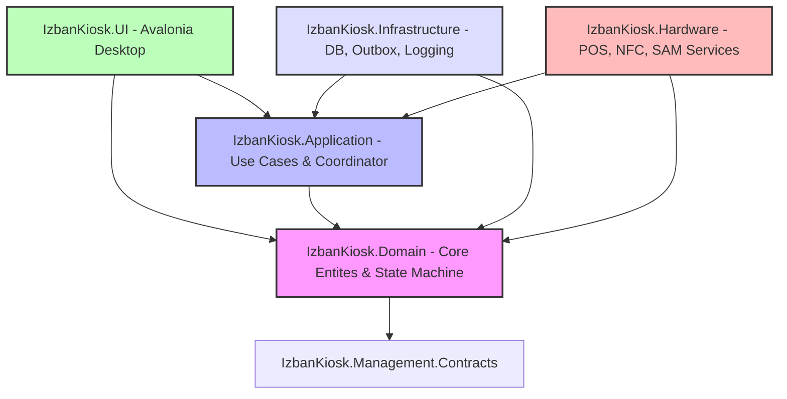

# Hedef Mimari Yapısı (docs/01-target-architecture.md)

İzban Temassız Ödeme Sistemi Kiosk uygulaması için önerilen çok katmanlı Clean Architecture yapısı ve bileşen sorumlulukları aşağıda detaylandırılmıştır.

---

## 1. Katmanlar ve Sorumluluklar

### A. IzbanKiosk.Domain
Sistemdeki tüm bağımlılıklardan arındırılmış, saf C# domain mantığını içerir.
- **Tutar ve Para Birimi:** `Money` Value Object (kuruş cinsinden `long` tutar ve `Currency` doğrulaması).
- **Kimlikler:** `TransactionId` (GUID/ULID sarmalayıcı).
- **Aggregate Root:** `KioskTransaction` aggregate'i. Ödeme ve yükleme işlemlerinin durumlarını, kurallarını ve olaylarını (Events) barındırır.
- **Durum Geçişleri:** İzin verilmeyen durum geçişlerini engelleyen domain bazlı durum makinesi.
- **Idempotency Kuralları:** Tekrarlanan transaction/idempotency anahtarlarını kontrol eden iş kuralları.

### B. IzbanKiosk.Application
İş mantığı orkestrasyonunu (Saga/Workflow) sağlar.
- **TransactionCoordinator:** POS ödemesini başlatma, bakiye doğrulama, karta yazma ve hata durumlarında reversal/compensating tetikleme işlemlerinin tetiğini çeker.
- **Recovery & Reversal Workflows:** Uygulama açılışında veya işlem sırasında yarıda kalan ödemeleri kurtaran, POS'a reversal gönderen veya manuel inceleme bayrağı koyan servisler.
- **Reconciliation Workflows:** Gün sonu mutabakatı veya periyodik mutabakat işlerini yöneten yapılar.
- **Application Services / Contract Interfaces:** Sunucu API ve UI katmanı ile haberleşecek temel kontrat arayüzleri.

### C. IzbanKiosk.Infrastructure
Veritabanı, arka plan servisleri ve harici sunucu API bağlantıları gibi altyapı detaylarını yönetir.
- **SQLite & EF Core / Dapper:** Kalıcı veri saklama deposu. SQLite WAL modu ve dosya yolu korumasıyla yapılandırılmıştır.
- **Outbox Pattern:** Kiosk çevrimdışıyken veya merkezi API kuyruğu doluyken transaction eventlerini yerel veritabanında saklayıp, arka planda güvenle sunucuya ileten mekanizma.
- **Structured Logging (Serilog):** JSON formatında, PCI-DSS kurallarına uygun (PAN/PIN maskeli) loglama sağlayan altyapı.
- **Hosting & Dependency Injection:** Microsoft.Extensions.Hosting ve Extensions.DependencyInjection entegrasyonu..NET AppEngine yaşam döngüsü yönetimi.

### D. IzbanKiosk.Hardware
POS, NFC ve bakiye doğrulama donanımlarının soyutlamalarını ve adapter'lerini içerir.
- **IPosTerminal & INfcReader:** Donanım modellerinden bağımsız üst interface tanımları.
- **PosCapability & NfcCapability:** Donanımın desteklediği özellikleri (Void, Reversal, PreAuth, Query vb.) dinamik olarak belirten yetenek modelleri.
- **Simulator & Mock Servisler:** Sadece `SIMULATOR` profilinde etkin olan ve donanımsız ortamda hata, iptal veya başarı testleri yapabilen simülatör sınıfları.
- **Real Vendor Adapters:** SDK veya DLL entegrasyon arayüzleri. Gelecekte gerçek donanım entegrasyonu için ayrılmış alan.

### E. IzbanKiosk.UI
Avalonia Desktop tabanlı kiosk ekranlarını barındırır.
- **MVVM Yaklaşımı:** MainWindow code-behind'daki tüm iş kuralları ViewModel (`MainViewModel`) sınıfına taşınır.
- **Simulator Kontrolleri:** Profil seçimine bağlı olarak simulator paneli gizlenir veya gösterilir. `PRODUCTION` modunda simülasyon butonu kesinlikle derlenmez/gözükmez.

### F. IzbanKiosk.Management.Contracts
Merkezi izleme ve yönetim sistemiyle haberleşmek için kullanılacak DTO (Data Transfer Object) ve servis tanımlarını içerir.

---

## 2. Üç Çalışma Profili Yapılandırması

Uygulama, derleme veya konfigürasyon bazında üç farklı profil üzerinden ayağa kalkar:
1. **Simulator**: Tamamen mock/simüle edilmiş POS ve NFC servislerini kullanır. UI üzerinde simülatör yönetim paneli görünür olur.
2. **HardwarePrototype**: Test ve staging ortamlarında test terminal parametreleriyle çalışır. Gerçek donanım SDK/DLL dosyalarını tetikler.
3. **Production**: Canlı acquirer ve İzmirim Kart API ortamını kullanır. Güvenlik doğrulamaları, mTLS cihaz kimliği ve otomatik güncelleme servisleri etkindir.
